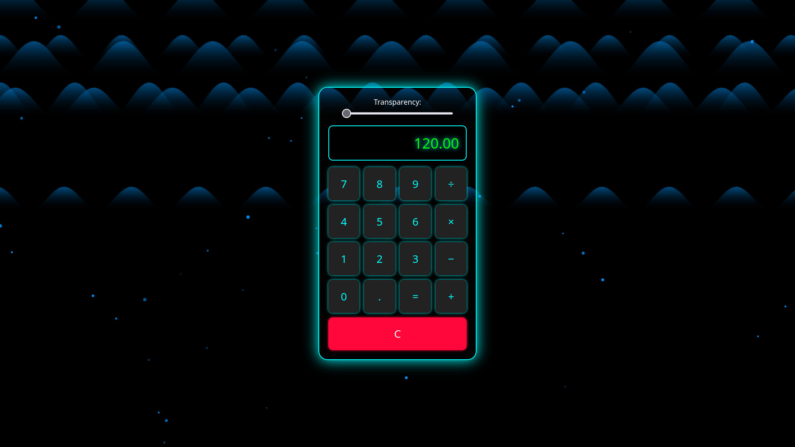

# 🌌 ESP8266 Neon Web Calculator 🚀

A neon-themed, fully interactive, transparent, and hover-animated **ESP8266-based web calculator.** 



## 🌜 **Features**
🗃️ **Web-based calculator running on ESP8266**  
🔦 **Dynamic neon effects** for a modern UI  
🌬️ **Aurora background animation**  
💡 **Adjustable transparency**  
🛠️ **ESP8266 onboard LED blinks on each calculation**  
🌐 **Fully responsive design (mobile-friendly)**  

## ⚙️ **Requirements**
- **ESP8266 (ESP-01, NodeMCU, etc.)**
- **Arduino IDE** or PlatformIO
- **ESP8266WiFi.h & ESP8266WebServer.h libraries**

## 🚀 **Setup Instructions**
1. Connect your ESP8266 to your computer.  
2. Install the required libraries in Arduino IDE or PlatformIO:  
   ```
   ESP8266WiFi.h
   ESP8266WebServer.h
   ```
3. **Update the SSID and password** to match your Wi-Fi network:  
   ```cpp
   const char* ssid = "YourWiFiName";
   const char* password = "YourWiFiPassword";
   ```
4. Upload the code to your ESP8266.  
5. **Find your ESP8266's IP address (e.g., `192.168.1.100`) and open it in a web browser.**  

## 📸 **Screenshot**


## 🌟 **How It Works**
- The ESP8266 **runs an HTTP server** that serves the calculator UI.  
- **JavaScript** captures user input and sends it to ESP8266 for calculation.  
- **ESP8266’s onboard LED blinks** when a calculation is performed.  

💡 **Fork this project or contribute if you’d like to improve it!**  
🔗 **[Check it out on GitHub](https://github.com/Efeckc17/ESP8266-WebCalc)**  

---

🎨 **Developed by [Toxi360](https://github.com/Efeckc17) 💻**

